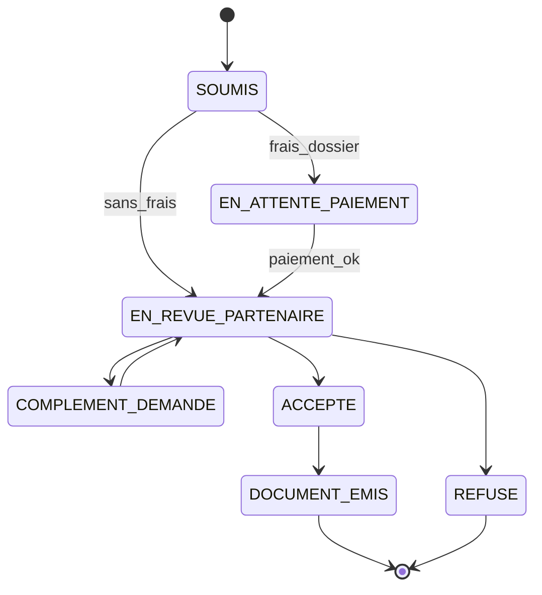

# PRD — BourseFi

**Plateforme digitale de bourses d'études au Sénégal**

Document de référence aligné avec la stratégie produit ; les annexes en fin de fichier décrivent le plan de livraison, la machine à états des dossiers et la stack réellement déployée dans le dépôt.

---

## 1. Présentation du projet

| Élément | Détail |
|--------|--------|
| **Nom du produit** | BourseFi |
| **Type de produit** | Plateforme web de : découverte de formations ; orientation académique ; gestion de bourses ; mise en relation entre candidats, écoles et partenaires financeurs. |

---

## 2. Vision du produit

BourseFi a pour mission de **démocratiser l'accès aux bourses d'études au Sénégal** en centralisant :

- les écoles partenaires ;
- les formations disponibles ;
- les offres de bourses ;
- les processus de candidature ;
- les paiements ;
- les documents officiels liés aux bourses.

La plateforme doit permettre à un étudiant de **trouver une formation, postuler à une bourse et obtenir son document officiel en quelques minutes sans déplacement physique**.

---

## 3. Objectifs principaux

### Objectifs business

- Digitaliser le processus d'attribution de bourses.
- Centraliser les offres des partenaires.
- Générer des revenus via **commissions sur les paiements**.
- Augmenter la visibilité des écoles partenaires.
- Réduire les démarches administratives physiques.

### Objectifs utilisateur

- Trouver facilement une formation adaptée.
- Accéder rapidement aux informations des écoles.
- Postuler simplement à une bourse.
- Suivre ses demandes depuis un **espace personnel**.
- Télécharger les **documents officiels** de bourse.

### Indicateurs de suivi (alignés section 14)

| Objectif | Indicateur |
|----------|------------|
| Friction parcours | Temps médian ; taux d'abandon par étape (modal) |
| Transparence | % fiches avec bailleur, critères, brochure |
| Finance | Taux paiements confirmés ; litiges tracés |
| Partenaires | Dossiers traités / semaine ; SLA document |

---

## 4. Problématique actuelle

Aujourd'hui au Sénégal :

- les informations sur les bourses sont **dispersées** ;
- les étudiants doivent **se déplacer** ;
- les démarches sont **longues** ;
- les écoles sont **difficilement comparables** ;
- les processus sont **peu digitalisés** ;
- plusieurs structures fonctionnent encore **manuellement**.

**BourseFi centralise et simplifie tout le parcours.**

---

## 5. Utilisateurs cibles

1. **Candidats / étudiants** — recherche d'école, formation, bourse, opportunités académiques.
2. **Partenaires financeurs** — mairies, agences, ONG, entreprises, collectivités, associations.
3. **Écoles partenaires** — visibilité, candidatures, formations, collaboration avec partenaires.
4. **Administrateurs BourseFi** — plateforme, validations, paiements, contenus, statistiques.

---

## 6. Architecture générale du produit

### Front office

| Zone | Contenu |
|------|---------|
| Landing page | Hero, CTA, écoles, formations, bourses, comment ça marche, stats, partenaires |
| Catalogue des écoles | Liste + fiches détaillées |
| Catalogue des formations | Liste + fiches + comparaison |
| Recherche & filtres | Par école, formation, métier, domaine, ville, niveau |
| Popup de candidature | **Obligatoire** : pas une page classique comme flux principal |
| Paiement | Mobile money, carte (intégration progressive) |
| Authentification | Comptes candidat |
| Dashboard candidat | Historique, statuts, documents, profil, paiements… |

### Back office partenaire

- Gestion des bourses (offres, quotas — à étendre selon produit).
- Gestion des candidatures.
- **Upload / association des documents officiels**.
- Suivi des paiements et **revenus / parts**.
- Statistiques.

### Back office école *(cible produit ; MVP actuel : contenu piloté par admin BourseFi)*

- Gestion des formations.
- Brochures et informations académiques.
- Gestion admissions (liaison avec partenaires).

### Back office BourseFi

- Validation partenaires et écoles.
- Gestion utilisateurs, écoles, formations.
- Gestion commissions et **transactions**.
- Analytics, modération contenus, support.

---

## 7. Fonctionnalités principales

### 7.1 Catalogue des écoles

**Objectif** : permettre de découvrir les écoles partenaires.

**Informations visées** (roadmap complète) : logo, nom, description, localisation, formations proposées, frais moyens, nombre de bourses, brochure, galerie, domaines, taux d'insertion, partenaires associés.

**Filtres visés** : ville, domaine, type d'établissement, niveau, disponibilité de bourses.

### 7.2 Catalogue des formations

**Informations par formation** (cible) : nom, école, description, durée, frais, diplôme, niveau requis, débouchés, métiers, compétences, programme détaillé, modalité d'admission, brochure PDF, nombre de bourses.

**UX** : navigation rapide, cartes modernes, comparaison, **mobile first**, chargement rapide.

### 7.3 Recherche intelligente

Recherche par école, formation, métier, domaine, ville, niveau ; **suggestions** (ex. Développement Web, Informatique, Marketing, Santé).

### 7.4 Système de bourses — processus utilisateur

1. **Choix** : école, formation, partenaire.
2. **Popup de candidature** — **IMPORTANT** : formulaire **dynamique, rapide, moderne, multi-étapes, responsive** ; **pas** une page comme parcours principal.
3. **Saisie** : prénom, nom, téléphone, email, niveau académique, documents éventuels.
4. **Paiement sécurisé**.
5. **Répartition automatique** : partenaire + BourseFi.
6. **Document officiel** fourni par le partenaire.
7. **Téléchargement immédiat** du document.

### 7.5 Dashboard candidat

Historique candidatures ; suivi statuts ; téléchargement documents ; profil ; **notifications** *(à brancher)* ; paiements ; **favoris** *(V2)* ; **reprise de candidature** *(V2 enrichie)*.

### 7.6 Dashboard partenaire

Création offres de bourses ; quotas ; candidatures ; upload documents ; statistiques ; revenus ; gestion paiements *(fonctions avancées par phases)*.

### 7.7 Dashboard admin BourseFi

Validation écoles / partenaires / contenus ; analytics ; utilisateurs ; transactions ; commissions ; support.

---

## 8. UX / UI requirements

### Philosophie

Extrêmement simple, rapide, moderne, émotionnel, **mobile first**.

### Ressenti attendu

Confiance, opportunité, ambition, facilité, accompagnement.

### Style

- **À éviter** : ton administratif, interface lourde, formulaires interminables, surcharge d'information.
- **À privilégier** : cartes premium, animations fluides, navigation intuitive, interactions rapides.

---

## 9. Landing page idéale

### Hero

- **Message** : *Trouvez votre bourse d'étude simplement.*
- **CTA** : Explorer les formations ; Trouver une bourse.

### Sections

Écoles partenaires ; formations populaires ; bourses disponibles ; comment ça marche ; témoignages ; statistiques ; partenaires officiels.

---

## 10. Paiement et finances

- Mobile money (**Wave**, **Orange Money**, **Free Money** en cible marché).
- Carte bancaire.
- Génération de **reçus** ; historique transactions.

### Répartition des fonds

Après paiement : **une part → partenaire**, **une part → BourseFi** (enregistrée côté application ; versement PSP selon intégration).

---

## 11. Notifications prévues

- Candidature reçue.
- Paiement confirmé.
- Document disponible.
- Bourse approuvée.
- Nouvelles opportunités.

*(Canal email / SMS / in-app selon roadmap.)*

---

## 12. Sécurité

- Chiffrement des données sensibles en transit ; bonnes pratiques stockage.
- Protection des documents ; accès par rôle.
- Authentification sécurisée ; **RBAC**.
- **Journalisation** des actions sensibles.

---

## 13. Technologies

### Suggestions générales (référence marché)

- Frontend : Vue / Nuxt, Tailwind, Pinia *(Pinia selon besoin état global)*.
- Backend : Laravel ou NestJS.
- Base : **PostgreSQL** en production recommandée.
- Paiement : Wave, Orange Money, Free Money, cartes.

### Réalisation actuelle du dépôt *(référence technique)*

- **Nuxt 4**, Vue 3, **Tailwind** ; API **Nitro** ; **Prisma** (SQLite dev, **PostgreSQL** recommandé en prod).
- Auth sessions + rôles `STUDENT`, `PARTNER`, `ADMIN` ; audit des actions.

---

## 14. KPIs principaux

Nombre de candidatures ; bourses attribuées ; taux de conversion ; revenus générés ; écoles partenaires actives ; partenaires actifs ; **taux de complétion** des candidatures.

---

## 15. Différenciateurs

1. **Centralisation nationale** des opportunités.
2. **Ultra-simplicité** du parcours.
3. **Orientation + financement** (pas seulement annuaire d'écoles).
4. **Processus entièrement digital** sans obligation de déplacement.
5. **Architecture multi-acteurs** : candidats, écoles, partenaires, BourseFi.

---

## 16. Vision long terme

Application mobile ; IA d'orientation ; matching intelligent formations / bourses ; scoring candidat ; chatbot ; espace recrutement entreprises ; marketplace stages / emplois ; **expansion Afrique de l'Ouest**.

---

## 17. Résumé stratégique

BourseFi n'est pas simplement une plateforme éducative. C'est une **infrastructure digitale** permettant aux étudiants d'accéder aux opportunités ; aux partenaires de digitaliser leurs processus ; aux écoles de gagner en visibilité ; au système de bourses de devenir **moderne, rapide et accessible**.

---

## Annexe A — Plan de réalisation (jalons livraison)

### Phase 0 — Cadrage

Cadre légal documents ; modèle économique ; PSP pilote ; partenaires / écoles pilotes.

### Phase 1 — MVP

Guichet public (écoles, formations, bailleurs visibles) ; **modal candidature** ; paiement *(simulation ou PSP minimal)* ; document partenaire ; espaces candidat et partenaire ; admin et audit.

### Phase 2 — Paiements et répartition

Webhooks PSP ; versements robustes ; reçus ; tableaux partenaires / admin enrichis.

### Phase 3 — Croissance

Notifications ; filtres recherche avancés ; témoignages ; back-office école dédié ; favoris mobile.

---

## Annexe B — Matrice conformité MVP / code *(indicatif)*

| Zone PRD | Statut MVP code |
|---------|------------------|
| Front : landing, ecoles, formations, popup candidature | Partiel à complet selon écran |
| Répartition paiement partenaire / BourseFi | Enregistrée sur transaction |
| Document officiel partenaire | Via URL déposée partenaire + téléchargement candidat |
| Back-office partenaire | Dossiers + statuts + document |
| Back-office école séparé | **Non** — contenu via seed / admin à prévoir |
| Recherche intelligente + filtres riches | À renforcer |
| Notifications listées §11 | **Non branchées** — roadmap |
| Reçus PDF automatiques | **À ajouter** |
| Landing hero libellés §9 au mot près | À harmoniser wording |

---

## Annexe C — Matrice écrans × acteurs *(étendue PRD §6)*

| Fonction | Public | Candidat | Partenaire | Ecole *(cible)* | Admin |
|----------|--------|----------|------------|-----------------|-------|
| Accueil, catalogues | Oui | Oui | — | — | CRUD |
| Recherche / filtres | Oui | Oui | — | — | — |
| Popup candidature | — | Oui | — | — | — |
| Paiement + splits | — | Oui | — | — | param / vue |
| Document bourse | — | DL | Dépose | — | supervise |
| Dashboard candidat | — | Oui | — | — | — |
| Dashboard partenaire | — | — | Oui | — | — |
| Dashboard ecole | — | — | — | V2 | — |
| Dashboard BourseFi | — | — | — | — | Oui |

---

## Annexe D — Machine à états dossier *(alignement technique)*

---

## Annexe E — Épics backlog *(synthèse)*

- Storytelling landing & CTAs §9.
- Catalogue écoles / formations enrichi §7.1–7.2.
- Modal candidature + champs §7.3–7.4.
- Paiement + ledger §10.
- Document partenaire + DL §7.4 étapes 6–7.
- Notifications §11.
- Back-office école §6.
- Recherche & suggestions §7.3.

---

## Annexe F — Historique document

| Version | Date | Notes |
|---------|------|--------|
| 0.1 | 2026-05-08 | Vision bailleurs Sénégal |
| **1.0** | **2026-05-09** | **Fusion PRD officiel utilisateur §1–17 + annexes plan / états / conformité MVP** |

---

*Fin du document.*
